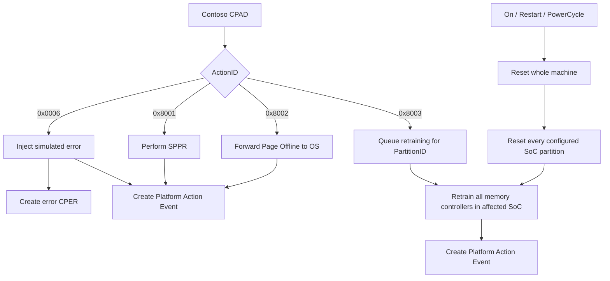

# Contoso CPAD Actions

This document defines the CPAD actions understood by the Contoso analyzer and
the simulated Contoso RAS endpoint. Contoso is a fictional SoC vendor used by
the demo.

## Ownership

The Contoso CreatorID is:

```text
11111111-2222-3333-4444-555555555555
```

Proprietary ActionIDs are interpreted using `(CreatorID, ActionID)`, not the
ActionID alone. Another vendor may assign a different meaning to the same
numeric proprietary ActionID.

## Action Summary

| ActionID | Action | Completion | Error CPER | Platform Action Event |
| --- | --- | --- | --- | --- |
| `0x0006` | Error Injection | Immediate | Yes | Immediate |
| `0x8001` | Soft Post Package Repair | Immediate | No | Immediate |
| `0x8002` | Page Offline | Immediate | No | Immediate |
| `0x8003` | Reboot with Memory Retraining | On a later SoC reset | No | After reset |

Error Injection is the only action that creates an error CPER.

## Lifecycle



HTTP `202 Accepted` reports that the BMC accepted a CPAD. The Platform Action
Event reports whether the endpoint action completed.

## `0x0006`: Error Injection

The injector supplies a Contoso error section describing the error to
simulate. The endpoint creates:

1. The requested error CPER.
2. A Platform Action Event CPER reporting the injection result.

No other action creates an error CPER.

## `0x8001`: Soft Post Package Repair

SPPR targets the DRAM location in a Contoso memory-controller section. The
endpoint validates that runtime soft PPR is supported, increments the repair
count for the target bank, and immediately emits a Platform Action Event.

The default Contoso memory analyzer currently recommends SPPR after corrected
errors identify failures at multiple columns on the same DRAM row.

## `0x8002`: Page Offline

Page Offline uses the valid physical address in the Contoso memory-controller
section. Demo pages are 4 KiB and the address must be 4 KiB aligned.

The endpoint simulates sending the page-offline request from the SoC to the
operating system. Success means the SoC accepted and forwarded the request; the
demo does not model a later OS acknowledgment or maintain an offline-page
inventory. The endpoint immediately emits a Platform Action Event.

The analyzer exposes a Page Offline CPAD builder. Automatic selection policy is
not yet defined.

## `0x8003`: Reboot with Memory Retraining

This action is scoped to the CPAD `PartitionID`, which represents a Contoso SoC.
It is not associated with an individual memory controller. When the SoC resets,
all of its memory controllers retrain.

At submission, the endpoint:

1. Validates the Contoso action and target partition.
2. Stores the CPAD as a pending retraining action.
3. Returns `202 Accepted`.
4. Does not emit a Platform Action Event yet.

The simulated BMC resets the whole machine. Therefore, a qualifying reset
includes every configured SoC partition and completes every matching pending
retraining action. Qualifying `ComputerSystem.Reset` values are:

- `On`
- `GracefulRestart`
- `ForceRestart`
- `PowerCycle`

`ForceOff` and `GracefulShutdown` do not perform retraining.

After a qualifying reset, the endpoint emits one Platform Action Event for each
pending CPAD. It removes a pending action only after that event is stored
successfully.

Pending state is process-local in this demo. It survives the simulated Redfish
reset but not a restart of the BMC server process.

The analyzer exposes a reboot-with-retraining CPAD builder. Automatic selection
policy is not yet defined.

## Analyzer Builders

[`ContosoAnalyzer`](analyzer-contoso.py) provides:

- `create_sppr_cpad_from_memory_event`
- `create_page_offline_cpad_from_memory_event`
- `create_reboot_with_retraining_cpad_from_memory_event`

All three copy the selected proprietary memory section into the CPAD. Page
Offline additionally requires a 4 KiB-aligned physical address. The retraining
action uses the CPAD PartitionID as its execution scope; memory coordinates in
the copied diagnostic section do not narrow that scope.

## Related Documentation

- [Contoso CPER Sections](contoso-cper-sections.md)
- [Contoso Analyzer Design](Analyzer-Design.md)
- [CPAD Submission](../../CPAD_SUBMISSION.md)
- [Policy Engine](../../POLICY_ENGINE.md)
- [RAS Plugin](../../../../src/plugins/ras/README.md)
- [RAS Endpoint Configuration](../../../../src/plugins/ras/RAS_ENDPOINT_CONFIGURATION.md)
