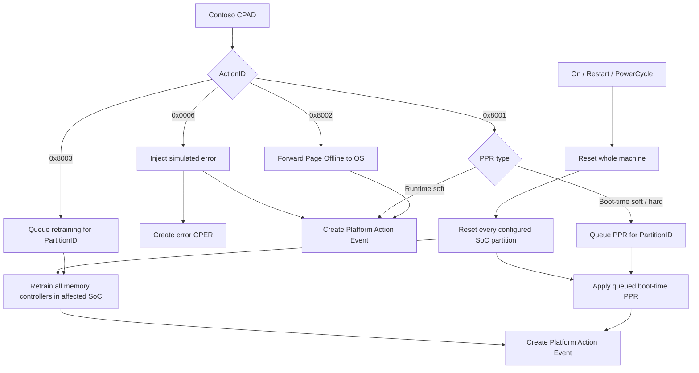

# Contoso CPAD Actions

This document defines the CPAD actions understood by the Contoso analyzer and
the simulated Contoso RAS endpoint. Contoso is a fictional SoC vendor used by
the demo.

## Ownership

The Contoso CreatorID is:

```text
11111111-2222-3333-4444-555555555555
```

Proprietary ActionIDs are interpreted using `(CreatorID, ActionID)`, not the
ActionID alone. Another vendor may assign a different meaning to the same
numeric proprietary ActionID.

## Action Summary

| ActionID | Action | Completion | Error CPER | Platform Action Event |
| --- | --- | --- | --- | --- |
| `0x0006` | Error Injection | Immediate | Yes | Immediate |
| `0x8001` | Post Package Repair | Runtime PPR: immediate; boot-time PPR: after reset | No | At completion |
| `0x8002` | Page Offline | Immediate | No | Immediate |
| `0x8003` | Reboot with Memory Retraining | On a later SoC reset | No | After reset |

Error Injection is the only action that creates an error CPER.

## Lifecycle



HTTP `202 Accepted` reports that the BMC accepted a CPAD. The Platform Action
Event reports whether the endpoint action completed.

## `0x0006`: Error Injection

The injector supplies a Contoso error section describing the error to
simulate. The endpoint creates:

1. The requested error CPER.
2. A Platform Action Event CPER reporting the injection result.

No other action creates an error CPER.

## Action-Parameter Section

Error injection keeps the original error-section GUID and body because its
payload describes the error to generate. All Contoso remediation actions use a
separate shared action-parameter section:

```text
a813b17b-db08-416b-810c-172668affb28
```

The CPAD section descriptor's ActionID selects the action-specific payload.
Every payload begins with this packed little-endian header:

```c
uint8_t  major_version;       // 1
uint8_t  minor_version;       // 0
uint16_t parameter_length;    // bytes after this header
uint8_t  parameter_version;   // 1
uint8_t  flags;               // must be zero
uint16_t reserved;            // must be zero
```

This keeps action parameters independent from the memory-error section and
lets each action codec validate only the fields that the SoC needs.

## `0x8001`: Post Package Repair

All PPR forms use the same target:

```c
uint8_t  ppr_type;
uint16_t chiplet;
uint16_t controller;
uint8_t  channel;
uint8_t  dimm;
uint8_t  subchannel;
uint8_t  rank;
uint8_t  device;
uint8_t  bank_group;
uint8_t  bank;
uint32_t row;
```

`ppr_type` uses the same bit value as the memory CPER's
`memory_repair_capabilities` field:

| Value | PPR type | Execution |
| --- | --- | --- |
| `0x01` | Runtime soft PPR | Immediate |
| `0x02` | Boot-time soft PPR | Next qualifying reset |
| `0x04` | Boot-time hard PPR | Next qualifying reset |

The endpoint requires exactly one type bit and checks it directly against the
capability field. Runtime soft PPR increments the repair count immediately.
Boot-time soft and hard PPR remain pending until `On`, `GracefulRestart`,
`ForceRestart`, or `PowerCycle`, then apply the repair and emit the Platform
Action Event.

The default Contoso memory analyzer currently recommends runtime soft PPR after
corrected errors identify failures at multiple columns on the same DRAM row.

## `0x8002`: Page Offline

Page Offline tells the operating system that one or more physical pages should
no longer be used. Most recommendations contain one page or a small set, while
a severe event may identify thousands. The format therefore needs to keep
small requests small without forcing a large sparse request into one enormous
CPAD.

The demo assumes:

- A 52-bit physical-address space.
- Fixed 4 KiB pages.
- A 40-bit physical page frame number (PFN), because the low 12 address bits
  are always zero.

PFNs are stored as packed five-byte little-endian integers. This saves three
bytes per page compared with carrying a 64-bit physical address and makes page
alignment inherent in the wire format.

### Page Offline header

The action-specific payload starts with:

```c
uint8_t  encoding;
uint8_t  flags;
uint16_t item_count;
uint32_t page_count;
```

`page_count` is the total number of unique pages represented by this CPAD.
`item_count` is interpreted by the selected encoding.

### Encoding 0: PFN list

```c
uint8_t page_frame_numbers[item_count][5];
```

This is the preferred representation for one page, small lists, and widely
scattered pages. PFNs must be sorted and unique, and
`item_count == page_count`.

### Encoding 1: ranges

```c
struct PageRange {
  uint8_t  start_page_frame[5];
  uint32_t page_count;
} ranges[item_count];
```

Ranges are sorted, nonoverlapping, nonadjacent, and have nonzero counts. This
encoding can represent thousands of contiguous pages with one nine-byte entry.

### Encoding 2: bitmap window

```c
uint8_t base_page_frame[5];
uint8_t bitmap[item_count];
```

Bit zero corresponds to `base_page_frame`. This encoding is useful for dense
sets with holes inside a bounded address window. `page_count` must equal the
number of set bits.

### Why the format has three encodings

No one representation is compact for every failure pattern:

| Page set | Best encoding | Action section size |
| --- | --- | ---: |
| One page | PFN list | 21 bytes |
| Ten scattered pages | PFN list | 66 bytes |
| 1,000 scattered pages | PFN list | 5,016 bytes |
| 1,000 contiguous pages | One range | 25 bytes |
| 4,096 dense pages in a 16 MiB window | Bitmap | 533 bytes |

The Contoso analyzer canonicalizes the requested page ranges, calculates the
size of each valid encoding, and chooses the smallest. A deterministic tie
prefers PFN list, then ranges, then bitmap. The DRAM-vendor analyzer describes
the desired pages but does not choose the binary encoding.

### Chunking large requests

The implementation limits one Page Offline action body to 16 KiB and one chunk
to 1,000,000 pages. If the smallest representation exceeds either limit, the
analyzer emits multiple CPADs. Chunked payloads set the `CHUNKED` flag and add:

```c
uint64_t batch_id;
uint16_t chunk_index;
uint16_t chunk_count;
```

The batch ID is derived deterministically from the source CPER reference and
canonical page set. Each chunk is independently idempotent and produces its
own Platform Action Event. Chunking does not promise all-or-nothing behavior;
failed chunks can be retried without repeating successful chunks.

Multiple CPADs are preferred over multiple sections in one large CPAD because
they bound the Redfish request size and simplify policy, retry, and
partial-failure behavior. All encodings still use ActionID `0x8002` and the
same Contoso action-parameter section GUID; different section types are not
needed because the requested operation is unchanged.

### Endpoint behavior

The endpoint simulates sending the page-offline request from the SoC to the
operating system. Success means the SoC accepted and forwarded the request; the
demo does not model a later OS acknowledgment or maintain an offline-page
inventory. The endpoint immediately emits a Platform Action Event.

The analyzer exposes a Page Offline CPAD builder. Automatic selection policy is
not yet defined. The direct builder creates a one-page range from the referenced
error address. A memory-vendor shim can request multiple explicit
`page_ranges`; the same encoder handles both paths.

The analyzer and endpoint independently validate the representation. Addresses
must be below `2^52`; ranges must not overflow the 40-bit PFN space; PFN lists
must be sorted and unique; range entries must be sorted, nonoverlapping, and
nonadjacent; bitmap padding must be canonical; and the decoded page count must
match the header. These checks prevent malformed counts or offsets from causing
unbounded expansion during action processing.

## `0x8003`: Reboot with Memory Retraining

This action has no action-specific payload. It is scoped to the CPAD
`PartitionID`, which represents a Contoso SoC.
It is not associated with an individual memory controller. When the SoC resets,
all of its memory controllers retrain.

At submission, the endpoint:

1. Validates the Contoso action and target partition.
2. Stores the CPAD as a pending retraining action.
3. Returns `202 Accepted`.
4. Does not emit a Platform Action Event yet.

The simulated BMC resets the whole machine. Therefore, a qualifying reset
includes every configured SoC partition and completes every matching pending
retraining action. Qualifying `ComputerSystem.Reset` values are:

- `On`
- `GracefulRestart`
- `ForceRestart`
- `PowerCycle`

`ForceOff` and `GracefulShutdown` do not perform retraining.

After a qualifying reset, the endpoint emits one Platform Action Event for each
pending CPAD. It removes a pending action only after that event is stored
successfully.

Pending state is process-local in this demo. It survives the simulated Redfish
reset but not a restart of the BMC server process.

The analyzer exposes a reboot-with-retraining CPAD builder. Automatic selection
policy is not yet defined.

## Analyzer Builders

[`ContosoAnalyzer`](analyzer-contoso.py) provides:

- `create_sppr_cpad_from_memory_event`
- `create_page_offline_cpad_from_memory_event`
- `create_reboot_with_retraining_cpad_from_memory_event`

The compatibility-named `create_sppr_cpad_from_memory_event` creates a generic
PPR action with `ppr_type=0x01`. Remediation builders encode the independent
action-parameter section rather than copying the memory-error body. Page
Offline obtains its physical address from the source event. Retraining uses the
CPAD PartitionID as its execution scope.

## Related Documentation

- [Contoso CPER Sections](contoso-cper-sections.md)
- [Contoso Analyzer Design](Analyzer-Design.md)
- [CPAD Submission](../../CPAD_SUBMISSION.md)
- [Policy Engine](../../POLICY_ENGINE.md)
- [RAS Plugin](../../../../src/plugins/ras/README.md)
- [RAS Endpoint Configuration](../../../../src/plugins/ras/RAS_ENDPOINT_CONFIGURATION.md)
