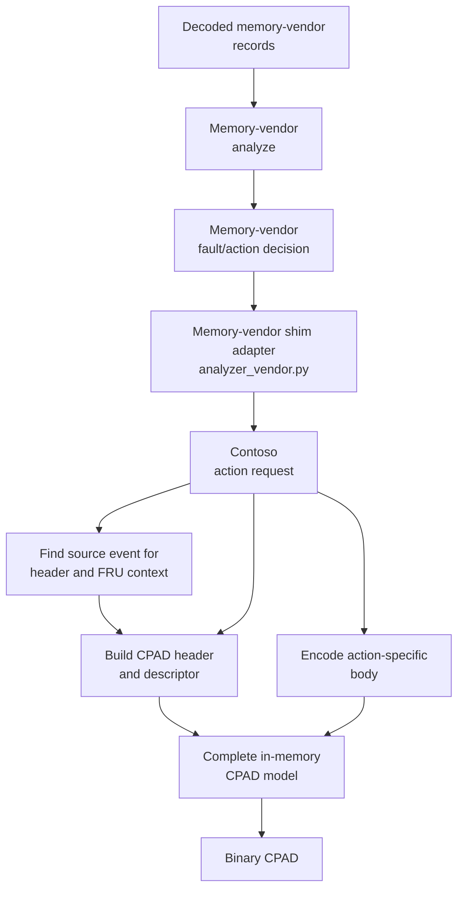

# Memory Vendor Analyzer Shim Interface

This document defines the common interface between the Contoso analyzer and
memory-vendor analyzers. It applies to every supported DRAM vendor, including
Micron, Samsung, and SK Hynix.

A memory-vendor shim is an adapter. It receives canonical decoded events from
the Contoso analyzer, translates them into the vendor analyzer's preferred
input, invokes the vendor analyzer, and translates the vendor decision into
source-referenced Contoso action requests.

The vendor analyzer does not need to understand the Contoso CPAD envelope,
binary action-section layouts, section offsets, GUIDs, or Base64 encoding.
Those remain Contoso responsibilities.

> **API version 5:** Memory-vendor analyzers return grouped CPAD proposals.
> Every section carries complete action parameters, confidence, urgency, and
> explicit FRU identity when the action targets a FRU. Version 4 shims are
> rejected because they cannot describe multi-section CPADs.

## Overall Flow



The diagram begins after the shim has translated canonical Contoso events into
the memory vendor's preferred decoded-record format. The vendor analyzer
returns its fault and action decision to the same shim, which converts each
executable recommendation into a Contoso action request.

Each action request refers back to an input record using `cper_file` and
`section_index`. The Contoso analyzer uses that reference only for CPAD
envelope and descriptor context, such as PlatformID, PartitionID, CreatorID,
FRU ID, and FRU text. Every value encoded in the action-specific section body
must come from the action request's `parameters` object.

The memory-vendor analyzer is responsible for interpreting the decoded CPER
and copying or deriving all parameters required by its recommended action.
The Contoso analyzer validates and encodes those parameters but does not fill
missing action-body fields from the original CPER.

## Responsibility Boundaries

| Component | Responsibilities |
| --- | --- |
| Contoso analyzer | Decode CPERs, select same-vendor history, construct canonical events, validate source references, and build complete CPADs. |
| Memory-vendor shim | Translate between canonical events/action requests and one vendor analyzer's API without dropping required action parameters. |
| Memory-vendor analyzer | Diagnose DRAM faults and return every parameter, confidence, and urgency required by each recommended action. |
| Contoso CPAD builder | Populate the CPAD envelope from CPER context and encode the supplied PPR, Page Offline, or retraining parameters without inferring section-body values. |
| Server-fleet policy | Decide whether a generated CPAD may be submitted. |
| Contoso endpoint | Validate and execute the approved action and emit a Platform Action Event. |

This separation allows each vendor analyzer to use its own terminology and
internal data model without duplicating Contoso protocol code.

## Implementation Map

| File | Role in the flow |
| --- | --- |
| [`memory_events.py`](../memory_events.py) | Decodes Contoso memory sections and Platform Action Events into canonical memory events. |
| [`contract.py`](contract.py) | Discovers shims, enforces the supported API version, deep-copies inputs, and validates the returned list shape. |
| `analyzer_<vendor>.py` | Adapts canonical events to one vendor analyzer and converts vendor decisions into Contoso action requests. |
| [`analyzer-contoso.py`](../analyzer-contoso.py) | Filters same-vendor history, validates source references, builds complete CPADs, and emits binary `.cpad` files. |
| [`contoso_action_parameters.py`](../contoso_action_parameters.py) | Validates and encodes action request parameters without reading decoded CPER events. |
| [`cper_decoder.py`](../../../cper_decoder.py) | Invokes libcper to encode binary CPADs and decode their standard envelope for policy. |

## Discovery

A shim is a Python file named `analyzer_*.py` in this directory. One shim may
register one or more exact DRAM manufacturer IDs:

```python
SHIM_INFO = {
    "api_version": 5,
    "name": "Example Memory Analyzer",
    "version": "1.0.0",
    "dram_manufacturer_ids": [[0x80, 0x2C]],
}
```

The Contoso analyzer invokes:

```python
def analyze_memory_events(events: list[dict]) -> list[dict]:
    ...
```

Inputs are deep-copied before invocation.

Memory-error inputs include `memory_organization` and `address_translation`.
Shim adapters may also import the stable
`physical_address_to_memory_address()` and
`memory_address_to_physical_address()` functions from `memory_shims`.

API version 5 returns CPAD proposals containing one or more section requests.
The Contoso analyzer still owns the binary envelope and section encoding.
Shims declaring an older API version are rejected explicitly.

## Adapter Pattern

A vendor shim should normally contain two translations around a vendor-owned
analyzer:

```python
def analyze_memory_events(events):
    vendor_records = [
        _to_vendor_record(event)
        for event in events
    ]
    vendor_decision = vendor_analyzer.analyze(vendor_records)
    return _to_contoso_cpad_proposals(vendor_decision, events)
```

`_to_vendor_record()` may flatten, rename, or derive fields for the vendor
tool. `_to_contoso_cpad_proposals()` must preserve source references and CPAD
grouping, translate only executable Contoso actions, and include every field
needed by each descriptor and action section body.

## Event Source Reference

Every event begins with:

```python
{
    "cper_file": "/path/to/original.cper",
    "section_index": 0,
    "event_type": "memory_error",
    ...
}
```

`cper_file` identifies the original binary CPER. `section_index` identifies the
zero-based section within that record. Both fields are present for
`memory_error` and `platform_action` events.

Every event also exposes the source section's FRU identity directly:

```python
{
    "fru_id": "75824856-bd36-2cc8-61f4-39bb3276da2a",
    "fru_text": "DIMM A1",
    "fru": {
        "id": "75824856-bd36-2cc8-61f4-39bb3276da2a",
        "text": "DIMM A1",
    },
}
```

The top-level aliases are convenient for vendor adapters; the nested `fru`
object remains available for compatibility.

The full decoded memory data remains available under `memory_error`, including
the address, chiplet/controller, DIMM coordinates, DRAM manufacturer,
temperature, and repair history.

Platform Action Event inputs use the same first three fields and carry the
action result under `platform_action`. A correlated action event also carries
the original memory target. This lets a vendor analyzer determine whether an
earlier recommendation succeeded before suggesting a follow-up action.

## CPAD Proposals and Section Requests

A shim returns zero or more CPAD proposal dictionaries. Each proposal contains
the sections that must be emitted together:

```python
{
    "sections": [
        {
            "cper_file": "/path/to/original.cper",
            "section_index": 0,
            "action_id": "0x8001",
            "confidence": 90,
            "urgency": True,
            "parameters": {
                "fru_id": "75824856-bd36-2cc8-61f4-39bb3276da2a",
                "fru_text": "DIMM A1",
                "ppr_type": 0x01,
                "chiplet": 0,
                "controller": 0,
                "channel": 0,
                "dimm": 1,
                "subchannel": 0,
                "rank": 0,
                "device": 3,
                "bank_group": 2,
                "bank": 3,
                "row": 1234,
            },
        },
    ],
}
```

Rules:

- `sections` must be a non-empty list.
- Sections grouped into one proposal must use the same ActionID and execution
  domain.
- `cper_file` and `section_index` must identify one input `memory_error`.
- `action_id` must be a supported Contoso remediation action.
- `confidence` is an integer from 0 through 100.
- `urgency` is a strict boolean selected by the vendor analyzer.
- FRU-targeting actions require `parameters.fru_id` and
  `parameters.fru_text`.
- `parameters` contains the remaining complete action-specific section-body
  input.
- Returning `[]` means analysis succeeded and no action is recommended.
- Raising an exception means the shim failed; default Contoso analysis may run.

The Contoso analyzer builds the complete CPAD, including the target platform,
most recent error PartitionID, CreatorID, FRU, shared action-parameter section,
and binary encoding.

## How Requests Become CPADs

For every returned section request, the Contoso analyzer:

1. Matches `cper_file` and `section_index` to exactly one input memory-error
   event.
2. Validates explicit FRU identity for PPR, Page Offline, Reseat, Shuffle, and
   Replace. Power Cycle and Reboot with Retraining may use the single
   unambiguous FRU on the newest CPER as correlation context.
3. Gets PlatformID, CreatorID, and the target PartitionID from the newest
   relevant memory-error event.
4. Validates the ActionID, confidence, urgency, and action-specific parameters.
5. Encodes only the supplied parameters into the shared Contoso
   action-parameter section.
6. Populates one descriptor per request, including its FRU ID, FRU text,
   ActionID, confidence, and urgency.
7. Writes a binary `.cpad` file; conversion JSON remains temporary.

Every CPAD section descriptor has valid FRU ID and FRU text. For machine- or
partition-scoped actions, a fallback FRU is diagnostic context and does not
narrow the action's execution target.

The shared action-parameter section GUID is:

```text
a813b17b-db08-416b-810c-172668affb28
```

Large Page Offline requests may produce several independently retryable CPADs.
The Contoso analyzer chooses PFN-list, range, or bitmap encoding and adds batch
metadata when chunking is required. The vendor shim describes the desired page
ranges but does not select the wire encoding.

Reseat Part, Shuffle Part, and Replace Part requests carry only `fru_id` and
`fru_text`; their encoded bodies remain empty. Power Cycle has an empty
parameter object and receives fallback FRU context. Approved standard
control-plane actions are stored and reported by the Analysis Orchestrator
rather than being submitted to the Contoso endpoint.

## CPAD Builder Contract

The implementation enforces the section-body boundary in its function
signatures. The action encoder accepts only the ActionID and complete action
parameters:

```python
encode_action_parameter_bodies(
    action_id,
    parameters,
)
```

It does not accept a decoded CPER event. The envelope builder receives
CPER-derived context separately:

```python
build_action_cpads(
    header_context,
    fru_context,
    action_id,
    confidence,
    urgency,
    parameters,
)
```

Confidence and urgency are analyzer-provided inputs to server-fleet policy.
Policy may deny an action based on either field and may prioritize an approved
urgent action. The endpoint does not use either field when executing the
action.

## FRU resolution

FRU-targeting actions (`0x0003`, `0x0004`, `0x0005`, `0x8001`, and `0x8002`)
must provide both common descriptor parameters:

```python
{
    "fru_id": "75824856-bd36-2cc8-61f4-39bb3276da2a",
    "fru_text": "DIMM A1",
}
```

The adapter removes these fields before action-body encoding. The pair must
match the referenced memory-error event. FRU text must fit in the CPAD
descriptor's 19-byte text payload.

Power Cycle and Reboot with Retraining may omit the pair. The framework then
uses the one unique FRU from the newest CPER. Missing or ambiguous newest-CPER
FRU data is an error.

Every Page Offline section identifies exactly one FRU. All pages and ranges in
that section must belong to that FRU. Different FRUs require different
sections, ranges are canonicalized within each section, and overlapping pages
assigned to different FRUs are rejected.

Action-specific validation and encoding are isolated by ActionID:

```python
ACTION_PARAMETER_CODECS = {
    "0x8001": encode_ppr_parameters,
    "0x8002": encode_page_offline_parameters,
    "0x8003": encode_retraining_parameters,
}
```

Each codec accepts only its complete `parameters` object. Adding another
Contoso action means registering a new schema and codec; it does not give the
codec permission to inspect the source CPER for missing fields.

This separation prevents a codec from silently filling missing section-body
fields from a source error. The default Contoso analyzer may use decoded CPER
data when making its own decision, but it must materialize a complete
`parameters` object before calling the same builder used for vendor requests.
Builder-generated transport metadata, such as Page Offline chunk indexes, may
be added during encoding; semantic action parameters must come from the
analyzer request.

The implemented boundary guarantees:

1. `encode_action_parameter_bodies()` accepts `(action_id, parameters)` only.
2. PPR requests must contain every field shown below.
3. `_build_action_cpads()` passes no decoded event to the section-body codec.
4. Source-event lookup is retained only for CPAD header, FRU, and correlation
   fields.
5. The default Contoso row analyzer materializes the same complete PPR
   parameter object before calling the builder.
6. Page Offline batch metadata is derived from the ActionID and canonical
   supplied page set rather than from CPER section-body data.
7. Contract tests verify that identical parameters produce identical action
   bodies even when the CPAD envelopes come from different source CPERs.

## Supported Requests

### Post Package Repair: `0x8001`

```python
{
    "ppr_type": 0x01,
    "chiplet": 0,
    "controller": 0,
    "channel": 0,
    "dimm": 1,
    "subchannel": 0,
    "rank": 0,
    "device": 3,
    "bank_group": 2,
    "bank": 3,
    "row": 1234,
}
```

The vendor analyzer obtains these values from its decoded input records and
returns them explicitly. The CPAD builder does not retrieve missing PPR
coordinates from the referenced CPER.

| Value | Type |
| --- | --- |
| `0x01` | Runtime soft PPR |
| `0x02` | Boot-time soft PPR |
| `0x04` | Boot-time hard PPR |

The values match the `memory_repair_capabilities` bits in Contoso memory CPERs.

### Page Offline: `0x8002`

```python
{
    "pages": [
        0x0000000012345000,
        0x0000000012347000,
    ],
    "page_ranges": [
        {
            "start_address": 0x0000000012345000,
            "page_count": 1,
        }
    ]
}
```

`pages` and `page_ranges` are both optional, but at least one must be nonempty.
Each address must be below `2^52` and aligned to 4 KiB. Page counts must be
positive. Pages and ranges may overlap; the Contoso analyzer canonicalizes
their union before choosing the smallest PFN-list, range, or bitmap wire
encoding. Very large requests may produce several CPADs sharing one batch ID.

The endpoint prints which page or how many pages it offlined, emits the action
event, and discards the page set. It does not track a cumulative page count and
does not add Page Offline state to CPERs.

### Standard Control-Plane Actions

```python
{}
```

| ActionID | Meaning |
| --- | --- |
| `0x0002` | Power Cycle |
| `0x0003` | Reseat Part |
| `0x0004` | Shuffle Part / DIMM dance |
| `0x0005` | Replace Part |

These requests use the referenced CPER's FRU ID and FRU text in the CPAD
descriptor. They do not encode FRU identity in the action section body.

### Reboot with Memory Retraining: `0x8003`

```python
{}
```

The action applies to the CPAD PartitionID and therefore needs no additional
payload.

## Complete Shim Example

```python
def analyze_memory_events(events):
    newest_error = next(
        event for event in events
        if event["event_type"] == "memory_error"
        and event["source"]["is_newest"]
    )
    if newest_error["spd_temperature"] < 85:
        return []
    error = newest_error["memory_error"]
    subcomponent = error["subcomponent"]
    location = error["additional"]
    return [{"sections": [{
        "cper_file": newest_error["cper_file"],
        "section_index": newest_error["section_index"],
        "action_id": "0x8001",
        "confidence": 90,
        "urgency": False,
        "parameters": {
            "fru_id": newest_error["fru_id"],
            "fru_text": newest_error["fru_text"],
            "ppr_type": 0x02,
            "chiplet": subcomponent["chiplet"],
            "controller": subcomponent["controller"],
            "channel": location["channel"],
            "dimm": location["dimm"],
            "subchannel": location["subchannel"],
            "rank": location["rank"],
            "device": location["device"],
            "bank_group": location["bank_group"],
            "bank": location["bank"],
            "row": location["row"],
        },
    }]}]
```

## Success, Failure, and Fallback

- Returning `[]` means the vendor analyzer handled the events and recommends
  no action. Default Contoso row analysis is suppressed for that vendor.
- Returning one or more valid requests transfers those recommendations to the
  Contoso CPAD builder.
- Raising an exception, returning an invalid request, or failing binary CPAD
  conversion marks the shim invocation as failed. Applicable newest errors
  then fall back to default Contoso analysis.
- Inputs are deep-copied, so vendor code cannot mutate the Contoso analyzer's
  canonical event list.

## Related Documentation

See [Contoso CPAD Actions](../contoso-cpad-actions.md) for the binary
action-parameter layouts and completion timing.

See [Contoso Analyzer Design](../Analyzer-Design.md) for event-window
selection, same-vendor history filtering, and fallback behavior.

See [Samsung Memory Analyzer Adapter](samsung-memory-analyzer.md) for the
Samsung-specific record and decision models.

See [CPAD Submission](../../../CPAD_SUBMISSION.md) for policy and Redfish
submission after the Contoso analyzer emits a CPAD.
