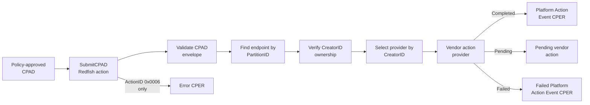

# RAS API Plugin

The RAS plugin adds the OCP RAS API discovery, CPAD submission, and CPER
LogService behavior used by the demo. The plugin owns the generic Redfish
transport and record lifecycle. Endpoint action providers own proprietary
section formats and proprietary ActionIDs.

## Responsibilities

The plugin:

- Publishes `RASService`, `RASEndpoints`, and `SubmitCPADActionInfo`.
- Accepts Base64-encoded binary CPADs through `RASService.SubmitCPAD`.
- Validates the CPAD envelope and target platform.
- Resolves the target endpoint by `PartitionID`.
- Verifies that the CPAD `CreatorID` owns that endpoint.
- Routes proprietary actions by `(CreatorID, ActionID)`.
- Stores error and Platform Action Event CPERs in the CPER LogService.
- Notifies endpoint action providers after a Redfish system reset.

CPER analysis is not performed in the BMC plugin. The Analysis Orchestrator
routes CPERs to vendor analyzers outside the BMC.

## Identity and Vendor Ownership

Each configured endpoint has a `PartitionID` and `CreatorID`:

- `PartitionID` identifies the hardware endpoint targeted by a CPAD.
- `CreatorID` identifies the vendor that owns the endpoint's proprietary data
  and actions.

Proprietary ActionIDs are meaningful only together with their CreatorID. Two
vendors may assign different meanings to the same proprietary ActionID.

```text
(CreatorID, ActionID) -> endpoint action provider
```

The demo registers the Contoso action provider for CreatorID
`11111111-2222-3333-4444-555555555555`. Other demo vendors can register their
own provider without adding their action logic to the generic submit handler.

## CPAD Processing



HTTP `202 Accepted` means the endpoint accepted the CPAD for processing. It
does not mean that the action completed. An immediate action produces its
Platform Action Event during submission. A deferred action produces that event
when its completion condition occurs.

Error injection (`0x0006`) is the only action that creates an error CPER. No
other action creates an error CPER.

See [CPAD Submission](../../../examples/ras_api_demo/CPAD_SUBMISSION.md) for the
complete transport and acceptance flow.

## System Reset Notifications

After a `ComputerSystem.Reset` operation updates the simulated system
successfully, the plugin loader notifies loaded plugins. The RAS plugin treats
the current demo's single ComputerSystem as the whole machine, so the reset
scope contains every configured RAS endpoint partition.

The Contoso provider uses this notification to finish pending reboot-with-
retraining actions. `On`, `GracefulRestart`, `ForceRestart`, and `PowerCycle`
trigger retraining. `ForceOff` and `GracefulShutdown` do not.

If the demo later exposes independently resettable ComputerSystems, endpoint
configuration will need an explicit mapping from each endpoint to its
ComputerSystem.

## Configuration

The plugin reads `ras_endpoint_config.json` from the active mockup directory.
The file defines the platform ID, endpoint identities, CreatorID ownership,
PartitionIDs, queues, FRU data, and optional `provider_config` data kept opaque
by the generic plugin.

- [Configuration reference](RAS_ENDPOINT_CONFIGURATION.md)
- [RAS Gen 1 configuration](../../../mockups/ras_gen1/ras_endpoint_config.json)

The current configuration contains Contoso-specific memory topology because
the Contoso provider simulates SPPR and reports authoritative memory data in
Contoso CPERs. That data includes a per-DIMM default SPD-device temperature;
an error injection may override the default for one emitted CPER so a
memory-vendor analyzer can exercise temperature-aware behavior. Real hardware
would update this measurement dynamically.

## Contoso Actions

The Contoso analyzer and endpoint action provider share a proprietary action
contract covering SPPR, Page Offline, and reboot with memory retraining. See
[Contoso CPAD Actions](../../../examples/ras_api_demo/analyzers/contoso/contoso-cpad-actions.md).

## Main Implementation Files

| File | Responsibility |
| --- | --- |
| `plugin.py` | Plugin lifecycle, RAS routes, and reset callback |
| `discovery.py` | RASService and RASEndpoint resources |
| `handlers/submit_cpad_action.py` | Generic CPAD acceptance and CPER storage |
| `action_provider.py` | Common action result model |
| `contoso_actions.py` | Contoso proprietary action execution |
| `contoso_memory.py` | Contoso memory-section decoding |
| `memory_config.py` | Endpoint and simulated memory configuration |
